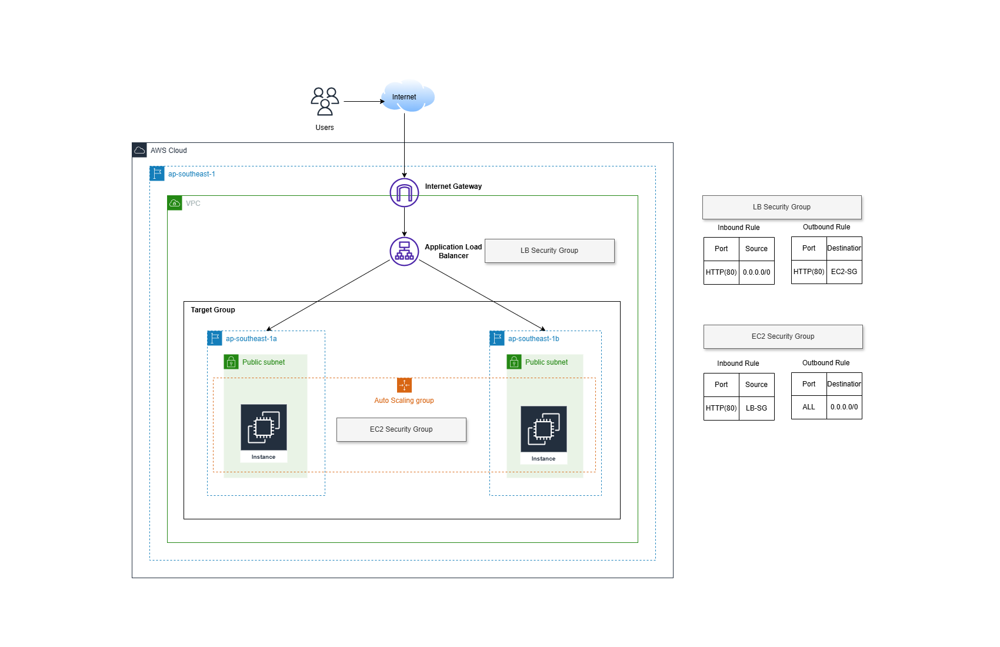

# terraform-ha-lab

## Overview
This repository contains a lab setup for deploying a high availability (HA) architecture on AWS using Terraform.

## Architecture Components

## Key Infrastructure Elements

- Default Virtual Private Cloud (VPC)
- Auto Scaling Group (ASG)
- Application Load Balancer (ALB)
- Launch Templates
- Multi-Availability Zone (Multi-AZ) Deployment
- Security Groups
- Target Group

## Architectural Diagram 
 
 


## Prerequisites
## Local Requirements

- Terraform 
- AWS CLI
- AWS Account
- Configured AWS Credentials

## Deployment Steps
1. Clone Repository
```bash
git clone https://github.com/wsyp1123/terraform-ha-lab.git
cd terraform-ha-lab
```

Before running `terraform init`, you must modify the S3 bucket name in the `backend/s3.tf` file.

#### Steps to Update S3 Bucket Name
- Locate the `backend/s3.tf` file in your project directory.
- Find the bucket name.
- Replace the existing bucket name with a unique name. Ensure the name is globally unique across AWS.


2. Initialize Terraform
```bash
terraform init 
```
3. Plan Deployment
```bash
terraform plan
```
4. Apply Configuration
```bash
terraform apply -auto-approve
```

## Verifying Deployment
### Steps
1. After running terraform apply, copy the Load Balancer DNS name from output.
2. Open the copied DNS name in a web browser.
3. Verify Nginx default page is displayed.

```bash
Welcome to nginx!

If you see this page, the nginx web server is successfully installed and
working. Further configuration is required.

For online documentation and support please refer to nginx.org.
Commercial support is available at nginx.com.

Thank you for using nginx.
```
## Cleanup
To destroy the entire infrastructure:
```bash
terraform destroy
```

